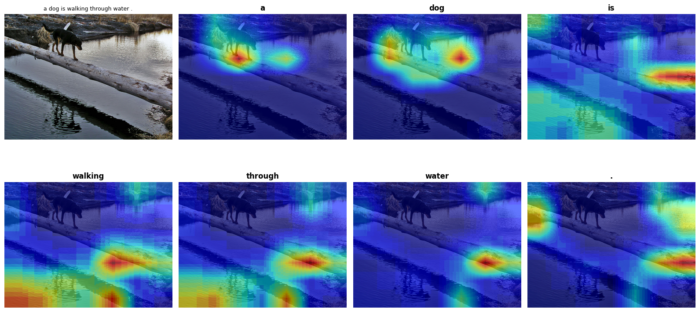
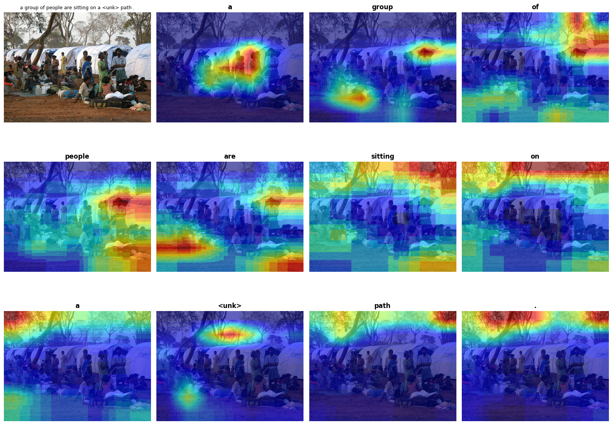

PyTorch implementation of "Show, Attend and Tell: Neural Image 
Caption Generation with Visual Attention" (Xu et al., 2015).

Generates NL captions for images using a convolutional neural network encoder to extract features from the image, deterministic attention to focus on one region at each word, and LSTM(long-short-term memory) decoder generating captions. 

## Visualization of Model Attention 


**"a dog is walking through water"**


When generating "dog" the model focuses on the dog's body. 
When generating "water" focus shifts to the surface below.

**"a man in a red shirt is skating on a sidewalk"**


When generating "red" the model correctly focuses on the shirt. 
When generating "sidewalk" focus shifts to the ground surface.

## Dataset
Flickr8k — 8,000 images, 5 reference captions each
- Train: 6,000 images (30,000 caption pairs)
- Val: 1,000 images
- Test: 1,000 images
- Vocabulary: 2,549 words (min frequency = 5)

## Stack
- PyTorch 2.8 with MPS backend (Apple M4)
- torchvision (ResNet50 encoder)
- NLTK (BLEU evaluation)
- Pillow, NumPy, Matplotlib

## How to run
```bash
# Install dependencies
pip install torch torchvision nltk pillow numpy matplotlib tqdm

# Download Flickr8k from:
# https://forms.illinois.edu/sec/1713398
# Place images in data/images/ and captions in data/captions/

# Run the notebook
jupyter notebook caption.ipynb
```

## Paper reference
Xu, K., Ba, J., Kiros, R., Cho, K., Courville, A., Salakhutdinov, R., 
Zemel, R., & Bengio, Y. (2015). Show, Attend and Tell: Neural Image 
Caption Generation with Visual Attention. ICML 2015.
https://arxiv.org/abs/1502.03044
